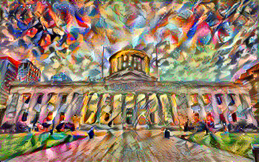
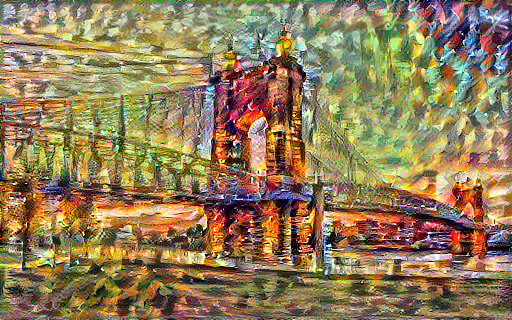
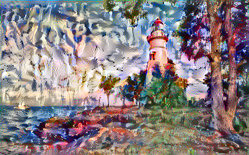

# NFT Art Creation 

With the rise in popularity of NFT art, I wanted to create art that could be auctioned off on the Ethereum platform through Solidity. To do this we will be using TensorFlow's style transfer.

"Neural style transfer is an optimization technique used to take two images—a content image and a style reference image (such as an artwork by a famous painter)—and blend them together so the output image looks like the content image, but “painted” in the style of the style reference image.

This is implemented by optimizing the output image to match the content statistics of the content image and the style statistics of the style reference image. These statistics are extracted from the images using a convolutional network."

For examples, I took three popular Ohio landmarks and transferred abstract expressionists and 1 modern impressionist. Below are the results.

## Original 

## Transfer

## Original 

## Transfer

## Original 

## Transfer

### For further information Nueral style transfers visit the ([Documentation](https://www.tensorflow.org/tutorials/generative/style_transfer))

